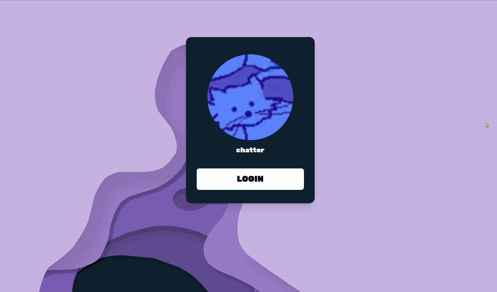

[![LinkedIn][linkedin-shield]](https://www.linkedin.com/in/graham-m-thomas)

<br />
<div align="center">
  <a href="https://github.com/GrahamMThomas/AtriocBigAwards-NominationForm">
    
  </a>

<h3 align="center">Atrioc BigAwards Nomination Form</h3>

  <p align="center">
    Allows users to side in with Twitch OAuth2 and then nomination chatters for awards to be voted on by the community
  </p>
</div>


<!-- Demo -->

## Demo




<!-- ABOUT THE PROJECT -->

## About The Project

This project offers a seamless nomination experience for Twitch users, encouraging engagement and interaction. Upon landing, users are greeted with a prompt to log in to Twitch, ensuring a personalized and secure nomination process.

#### Key Features:
##### 1. Twitch OAuth2 Authentication
Users are required to log in to their Twitch accounts, providing a simple user experience

##### 1. Dynamic Content
The app dynamically fetches categories from a CMS, organized by name and color. Allows us to dynamically update categories without code changes.

##### 1. User-Friendly Nomination
Users can easily select a category of their choice, enter relevant information, and submit their nominations. The streamlined process encourages participation.

##### 1. Responsive Design
Incorporating responsive design principles, the app caters to both mobile and desktop users. This project marks a significant learning milestone for me in adapting layouts for various screen resolutions.

##### 1. Full-Stack Endeavor
Breaking away from the norm, this project is a departure from Python or C# backends. Embracing a single framework for the entire stack showcases versatility and growth. Utilizing Server Side Rendering for secure API Calls.


### Tech Stack
- NextJS
- TailwindCSS
- Twitch OAuth2
- Strapi API

#### Guiding Principals
- Responsive Design
- SSR

<!-- GETTING STARTED -->

## Getting Started

### Prerequisites

- Install node (I used 20.9.0)

### Local Development

First, run the development server:

```bash
npm i
npm run dev
```

Open [http://localhost:3000](http://localhost:3000) with your browser to see the result.

<!-- TODOs -->

## TODOs

<!-- MARKDOWN LINKS & IMAGES -->
<!-- https://www.markdownguide.org/basic-syntax/#reference-style-links -->

[linkedin-shield]: https://img.shields.io/badge/-LinkedIn-black.svg?style=for-the-badge&logo=linkedin&colorB=555
